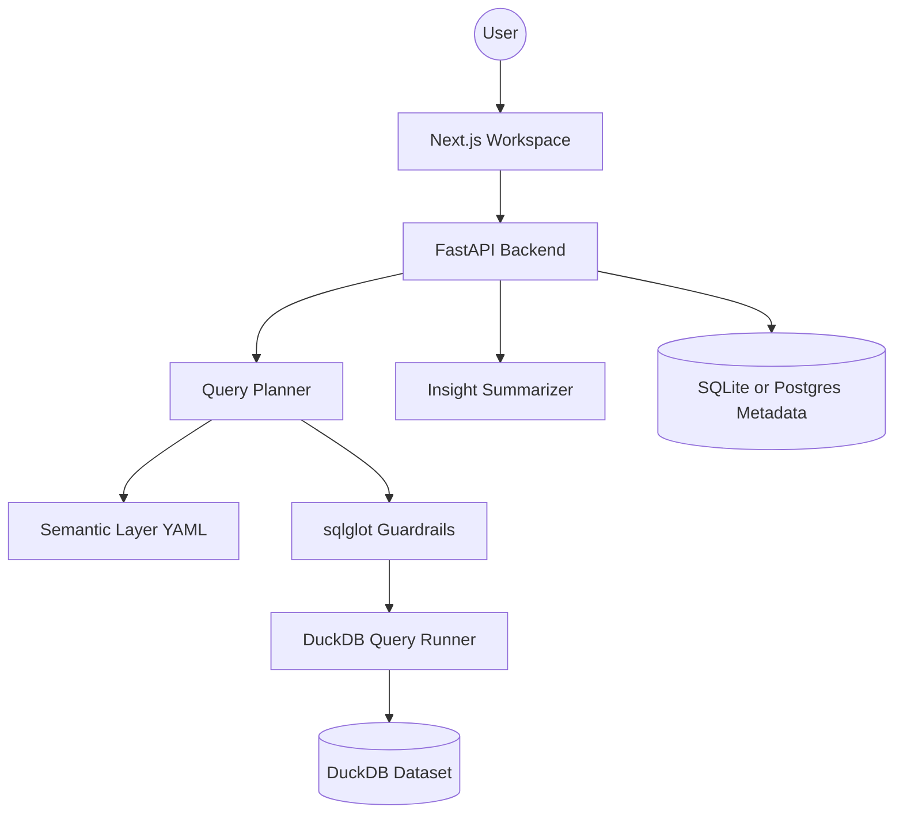

# HELIOS

HELIOS is an analytics engineering platform that turns business questions into governed SQL, local analytical execution, and explainable insights. It combines a Next.js workspace, a FastAPI backend, a semantic metric catalog, DuckDB query execution, and trust surfaces such as schema exploration, lineage, and data quality checks.

This repository is now set up as a production-oriented baseline for a single-tenant deployment. It includes stricter runtime configuration, typed API contracts, route-level tests, real health checks, safer CORS and host handling, request IDs, security headers, and a live frontend health indicator.

It is still not a finished enterprise platform. Authentication, RBAC, migrations, deployment automation, and external observability are still required for a full production program.

## Platform Areas

- Semantic metric catalog backed by `datasets/semantic/metrics.yaml`
- NL-to-SQL planning with `sqlglot` validation and read-only execution
- DuckDB analytics execution over seeded local data
- Insight generation with OpenAI-compatible providers, plus a local fallback mode
- Workspace persistence using SQLite by default, with Postgres configurable
- Schema explorer, data quality center, lineage view, and saved workspaces UI
- Health endpoints, request IDs, security headers, and route-level test coverage

## Architecture



## Runtime Requirements

- Python 3.11
- Node.js 18+
- Optional: Docker Compose for Postgres and Redis in shared environments
- Optional: OpenAI-compatible API key for LLM-backed planning and narration

## Quickstart

1. Copy environment defaults.

```bash
cp .env.example .env
```

2. Install dependencies.

```bash
make setup
```

3. Seed the DuckDB dataset.

```bash
make seed
```

4. Start the backend and frontend.

```bash
make api-dev
make web-dev
```

5. Run validation.

```bash
make test
```

## Configuration Notes

- By default, metadata persistence uses local SQLite at `datasets/helios_meta.db`.
- To use Postgres instead, set `DATABASE_URL` in `.env`.
- To enable LLM-backed planning and insight narration, set `LLM_API_KEY`.
- In production, set explicit `ALLOWED_ORIGINS` and `ALLOWED_HOSTS`. Wildcards are rejected.

## API Health

- `GET /api/v1/health` returns app status, environment, version, and dependency state.
- `GET /api/v1/health/dependencies` returns dependency-level checks for metadata storage and DuckDB.

## Current Gaps

- No user authentication or RBAC
- No migration workflow beyond SQLAlchemy `create_all`
- No background jobs, audit log, or external observability pipeline
- No container build or deployment manifests for managed infrastructure
- Local fallback planner is intentionally limited when no LLM API key is configured

## Suggested Next Steps

1. Add authentication and session management.
2. Replace `create_all` with Alembic migrations.
3. Add metrics, tracing, and centralized log shipping.
4. Introduce CI, container images, and deployment manifests.
5. Move frontend API access behind a server-side BFF or authenticated gateway.

## License

Choose a public license before publishing this repository on GitHub. The current repository does not include an open-source license grant.
