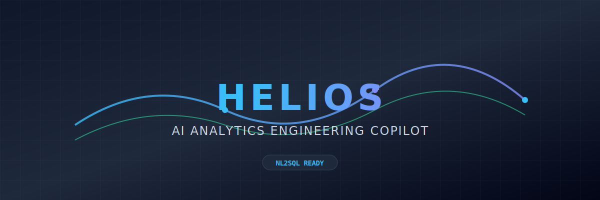
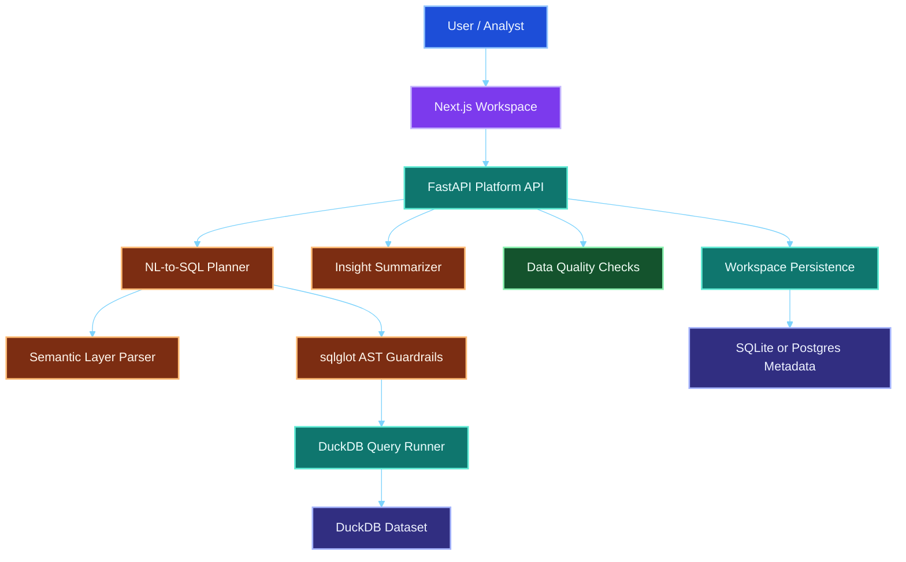
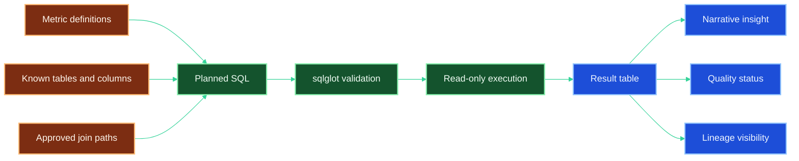

<p align="center">
  
</p>

<h1 align="center">HELIOS</h1>

<p align="center">
  <strong>Governed AI analytics engineering platform for semantic NL-to-SQL, trust-aware execution, and explainable insights.</strong>
</p>

<p align="center">
  <a href="https://www.python.org/downloads/release/python-3110/"></a>
  <a href="https://nextjs.org/"></a>
  <a href="https://fastapi.tiangolo.com/"></a>
  <a href="https://duckdb.org/"></a>
  <a href="https://openai.com/"></a>
  
</p>

<p align="center">
  
  
  
  
  
  
</p>

---

## What HELIOS Is

HELIOS is an analytics engineering platform designed around a simple idea:

> AI should not generate analytics answers by guessing.

Instead, HELIOS grounds SQL generation in a semantic layer, validates queries before execution, runs them in a read-only analytical engine, and returns both tabular results and business-facing insights. It is built as a serious engineering project, not a thin chat wrapper around a model API.

This repository currently represents a **production-oriented baseline** for a single-tenant deployment:

- governed NL-to-SQL planning
- semantic metric definitions
- local DuckDB execution
- health-aware API runtime
- typed backend contracts
- schema, quality, lineage, and workspace UI
- route-level backend coverage
- real local development workflow

It is **not yet a finished enterprise platform**. Authentication, RBAC, migrations, CI/CD, and production observability still need to be added.

---

## Why This Project Is Interesting

Most AI analytics demos stop at prompt engineering. HELIOS tries to address the harder system-design questions:

- How do you prevent hallucinated joins and invented columns?
- How do you keep SQL execution safe?
- How do you expose trust signals to the end user?
- How do you structure an analytics copilot as an actual product surface instead of a single chat box?
- How do you create a clean separation between semantic modeling, orchestration, execution, and UX?

That makes this repository useful for engineers interested in:

- AI product architecture
- analytics engineering
- semantic layer design
- trust and governance for LLM systems
- local-first data tooling
- full-stack system composition with Next.js and FastAPI

---

## Core Capabilities

| Area | What HELIOS Does | Why It Matters |
|---|---|---|
| Semantic grounding | Loads YAML-defined metrics, tables, and joins | Prevents the model from inventing business logic |
| SQL planning | Converts business intent into DuckDB-compatible SQL | Gives analysts a natural-language entry point |
| Guardrails | Uses `sqlglot` AST validation plus read-only DuckDB connections | Blocks destructive or unsafe queries |
| Execution | Runs governed SQL on local DuckDB datasets | Fast analytical iteration without cloud dependency |
| Insight narration | Summarizes results into business language | Makes outputs usable beyond raw tables |
| Trust surfaces | Exposes schema, lineage, and data quality views | Helps users decide whether to trust the output |
| Workspace history | Persists analytical sessions for later review | Makes the app feel like a system, not a toy demo |

---

## System Architecture

### 1. Product Architecture



### 2. Request Lifecycle


### 3. Trust and Governance Model



---

## Step-by-Step Product Breakdown

### 1. Semantic Layer

HELIOS starts with `datasets/semantic/metrics.yaml`, which defines:

- physical tables
- columns and descriptions
- join paths
- governed metrics such as `active_users`, `total_mrr`, and `churn_rate`

This semantic layer is injected into the planning process so the model is constrained by defined business logic instead of raw guesswork.

### 2. Planning Layer

The planner:

- accepts natural-language business questions
- builds an LLM prompt using semantic context
- extracts candidate SQL
- validates the result using `sqlglot`
- applies a local fallback mode when no LLM key is configured

### 3. Execution Layer

The execution engine:

- connects to DuckDB in read-only mode
- runs validated SQL
- returns columns, rows, and execution timing
- keeps the analytical path local-first and fast

### 4. Trust Layer

HELIOS includes explicit user-facing trust surfaces:

- **Schema Explorer** for physical datasets and samples
- **Metric Catalog** for governed business metrics
- **Semantic Lineage** for metric-to-table visibility
- **Data Quality Center** for freshness, completeness, and volume checks

### 5. Experience Layer

The workspace UI lets users:

- type business questions
- inspect generated SQL
- run and visualize results
- request an explanation
- save the session for later review

---

## Sample Outcomes

### Example 1: Daily Active Users

**Business question**

```text
Show daily active users
```

**Candidate SQL**

```sql
SELECT event_date,
       COUNT(DISTINCT user_id) AS active_users
FROM events
WHERE event_type = 'login'
GROUP BY 1
ORDER BY 1
LIMIT 100
```

**Representative response shape**

```json
{
  "columns": ["event_date", "active_users"],
  "rows": [
    ["2023-01-01T00:00:00", 60],
    ["2023-01-02T00:00:00", 55]
  ],
  "execution_time_ms": 3.2
}
```

**Narrative outcome**

```text
The query returned 100 rows. The first result is event_date=2023-01-01T00:00:00, active_users=60.
Configure LLM_API_KEY to enable richer AI narration.
```

### Example 2: Metric Governance

If the user asks for a governed metric such as total MRR, HELIOS is designed to prefer semantic definitions over ad hoc SQL fragments. That makes the system more useful for analytics engineering workflows than generic text-to-SQL demos.

---

## Tech Stack

### Platform Stack

| Layer | Technologies |
|---|---|
| Frontend | Next.js 14, React 18, Tailwind CSS, Recharts, Lucide |
| Backend | FastAPI, Pydantic, SQLAlchemy |
| Query Validation | sqlglot |
| Analytical Engine | DuckDB, Parquet |
| Model Integration | OpenAI-compatible APIs |
| Persistence | SQLite by default, Postgres configurable |
| Testing | pytest |
| Local Runtime | Makefile, Docker Compose |

### Stack Icons

<p>
  
  
  
  
  
  
  
  
</p>

---

## Repository Walkthrough

```text
helios/
├── apps/
│   ├── api/                  # FastAPI backend
│   │   ├── app/
│   │   │   ├── api/v1/routes/
│   │   │   ├── core/
│   │   │   ├── db/
│   │   │   ├── models/
│   │   │   └── services/
│   │   └── tests/
│   └── web/                  # Next.js frontend
│       ├── app/
│       ├── components/
│       └── lib/
├── datasets/
│   ├── raw/                  # Seeded parquet files
│   └── semantic/             # Metric and schema definitions
├── docs/                     # Architecture references and assets
├── scripts/
│   ├── seed/
│   └── eval/
└── docker-compose.yml
```

---

## Local Development

### Prerequisites

- Python 3.11
- Node.js 18+
- Optional: Docker Compose for Postgres and Redis
- Optional: OpenAI-compatible key for model-backed planning and narration

### Quickstart

```bash
cp .env.example .env
make setup
make seed
make api-dev
make web-dev
```

### Validation

```bash
make test
```

### Runtime Notes

- Metadata uses local SQLite by default via `datasets/helios_meta.db`
- You can switch metadata to Postgres with `DATABASE_URL`
- `LLM_API_KEY` enables richer planning and narration
- host and origin configuration are explicitly validated for production mode

---

## Engineering Details Worth Learning From

This repository is useful because it shows several practical engineering patterns in one place:

### Semantic grounding over prompt-only systems

The project shows how to reduce hallucination risk by grounding the planner in a structured metric catalog instead of relying on broad schema dumps alone.

### Trust-aware LLM product design

The product surface does not stop at model output. It exposes:

- the generated SQL
- data quality status
- schema details
- semantic lineage
- persisted workspaces

That is a more realistic product pattern for AI in analytics.

### Safe execution design

The combination of `sqlglot` validation and read-only DuckDB connections is a strong example of defense in depth for generated SQL execution.

### Full-stack system composition

The project also shows how a modern AI feature can be composed across:

- frontend UX
- backend orchestration
- semantic metadata
- analytical runtime
- persistence
- testing

---

## Current Platform Status

### What is already solid

- local-first end-to-end flow
- clear semantic layer entry point
- production-style FastAPI middleware baseline
- route-level backend tests
- frontend production build
- coherent GitHub-ready repository structure

### What is still missing for a full production program

- authentication and RBAC
- Alembic migrations
- CI/CD pipeline
- deploy manifests and container images
- metrics, tracing, and centralized logging
- multi-tenant isolation

---

## Roadmap

### Near-Term

1. Add authentication and session control
2. Replace `create_all` with migrations
3. Add structured observability and error dashboards
4. Add CI for backend tests and frontend build
5. Add deployment manifests for managed runtime environments

### Longer-Term

1. Expand semantic modeling beyond the current YAML shape
2. Add richer eval datasets and benchmark scoring
3. Introduce background jobs for heavier orchestration
4. Add warehouse connectors beyond local DuckDB
5. Support multi-workspace or multi-tenant isolation

---

## Supporting Documents

- [Architecture Notes](./docs/architecture.md)
- [Platform Overview](./Design%20Doc/platform_overview.md)
- [Full Design Specification](./Design%20Doc/HELIOS_Full_Design_Specification.md)

---

## License

Choose and add an explicit public license before treating this repository as open source. Right now the repository does not include a license grant.
